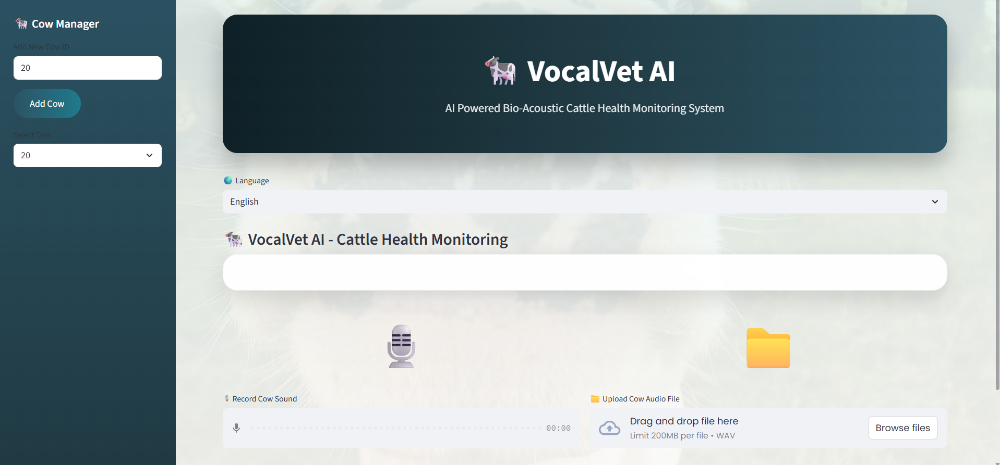
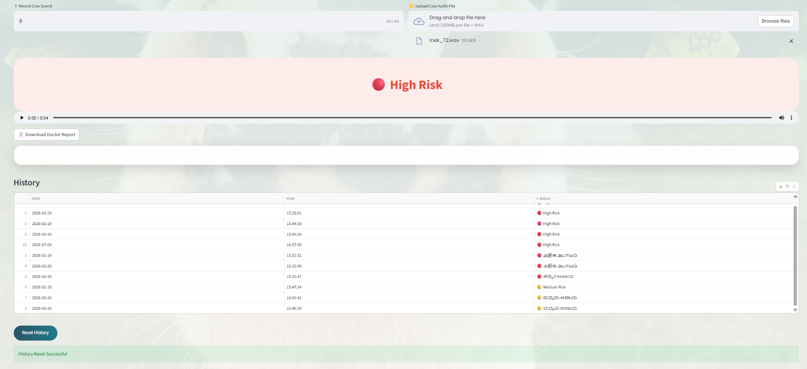
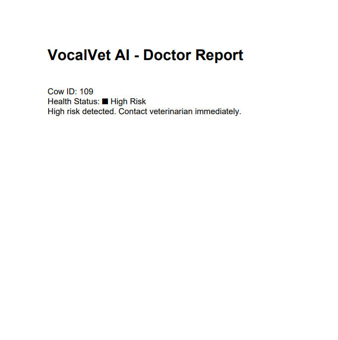

# 🐄 VocalVet AI

## 📌 Overview

VocalVet AI is an AI-powered bio-acoustic cattle health monitoring system that assists farmers and veterinarians in assessing cattle health using breathing sounds. The application analyzes recorded or uploaded cow audio, predicts health conditions using Machine Learning, provides multilingual voice feedback, generates downloadable doctor reports, and maintains health records for each cow.

The system aims to support early disease detection through non-invasive audio analysis, making cattle healthcare more accessible and efficient.

---

## ✨ Features

- 🐄 Add and manage multiple cattle profiles
- 🎙️ Record live cow breathing sounds
- 📁 Upload WAV audio recordings
- 🤖 AI-powered cattle health prediction
- 🌍 Multilingual interface (English, Hindi, Kannada, Tamil, Telugu, Punjabi)
- 🔊 Voice feedback using Google Text-to-Speech (gTTS)
- 📄 Download AI-generated doctor reports in PDF format
- 📊 Maintain cow-wise health history
- 💾 Automatic record storage
- 🎨 Modern interactive Streamlit interface

---

## 🛠️ Technologies Used

- Python
- Streamlit
- Scikit-learn
- Joblib
- Librosa
- NumPy
- Pandas
- Google Text-to-Speech (gTTS)
- ReportLab
- Machine Learning
- MFCC (Mel-Frequency Cepstral Coefficients)

---

## ⚙️ How It Works

1. Add or select a cow profile.
2. Record the cow's breathing sound or upload a WAV audio file.
3. Extract MFCC audio features using Librosa.
4. Analyze the audio using a trained Machine Learning model.
5. Display the predicted health status.
6. Generate multilingual voice feedback.
7. Save the diagnosis to the cow's health history.
8. Generate and download a PDF doctor report.

---

## 📂 Project Structure

```text
VocalVet-AI/
│
├── app.py
├── model.pkl
├── cows/
│   ├── cow1.csv
│   ├── cow2.csv
│   └── ...
├── requirements.txt
├── README.md
├── .gitignore
└── screenshots/
    ├── home.png
    ├── prediction.png
    ├── report.png
    └── history.png
```

---

## 📸 Screenshots

### 🏠 Home Page



---

### 🤖 AI Health Prediction



---

### 📄 Doctor Report



---

## 🚀 Installation

Clone the repository

```bash
git clone https://github.com/your-username/VocalVet-AI.git
```

Navigate to the project directory

```bash
cd VocalVet-AI
```

Install dependencies

```bash
pip install -r requirements.txt
```

Run the application

```bash
streamlit run app.py
```

---

## 📋 Requirements

- Python 3.10+
- Streamlit
- Librosa
- Scikit-learn
- Joblib
- NumPy
- Pandas
- ReportLab
- gTTS

---

## 🎯 Applications

- Smart dairy farms
- Veterinary clinics
- Livestock monitoring
- Early disease detection
- Precision agriculture
- AI-assisted cattle healthcare

---

## 🔮 Future Enhancements

- Deep Learning-based disease classification
- Real-time respiratory disease detection
- Mobile application support
- IoT sensor integration
- Cloud-based cattle health records
- Veterinary appointment scheduling
- Breed-specific disease prediction
- Disease probability score with confidence percentage

---

## 👩‍💻 Author

** C Harshitha **

Computer Science Engineering Student

GitHub: https://github.com/Harshithacodes24

---

## 📄 License

This project is developed for educational and research purposes.
